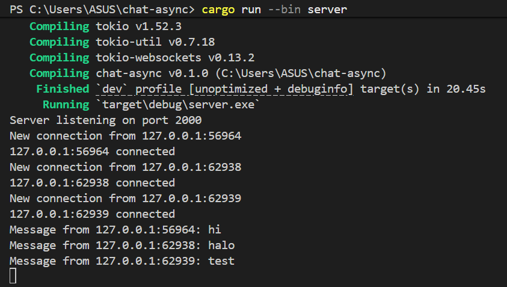
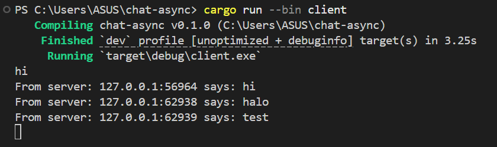
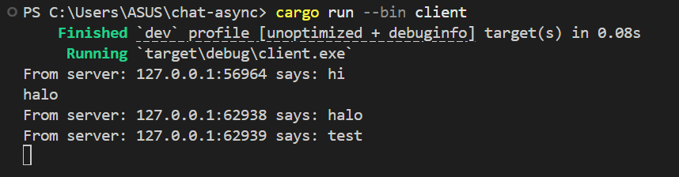
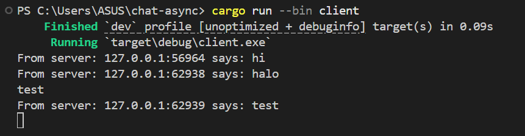

# Experiment 2.1: Original code, and how it run

- Server

- Client

Pada eksperimen ini, program dijalankan menggunakan satu server dan tiga client secara bersamaan. Server berfungsi sebagai pusat komunikasi yang menerima pesan dari setiap client lalu melakukan broadcast ke semua client lain yang terhubung. Untuk menjalankan program, pertama menjalankan server menggunakan perintah `cargo run --bin server`, kemudian membuka beberapa terminal lain untuk menjalankan client menggunakan `cargo run --bin client`. Ketika salah satu client mengetik pesan, pesan tersebut dikirim ke server melalui websocket lalu diteruskan kembali ke semua client yang sedang aktif. Hal ini menunjukkan bagaimana asynchronous programming memungkinkan banyak koneksi berjalan secara bersamaan tanpa saling blocking. Selain itu, penggunaan websocket membuat komunikasi berlangsung secara real-time sehingga pesan langsung muncul pada seluruh client yang terhubung.

# Experiment 2.2: Modifying port

Pada eksperimen ini, saya mengubah port websocket dari 2000 menjadi 8080. Perubahan dilakukan pada dua sisi, yaitu file server.rs dan client.rs. Pada sisi server, bagian `TcpListener::bind()` diubah agar server berjalan pada port 8080. Sementara itu, pada sisi client, URI websocket pada `ClientBuilder::from_uri()` juga harus diubah menjadi `ws://127.0.0.1:8080` agar client dapat terhubung ke server yang benar. Jika hanya salah satu sisi yang diubah, maka koneksi websocket akan gagal karena port server dan client tidak sama. Selain itu, protocol websocket yang digunakan pada program ini adalah `ws://`, yang menunjukkan bahwa komunikasi dilakukan menggunakan websocket protocol.